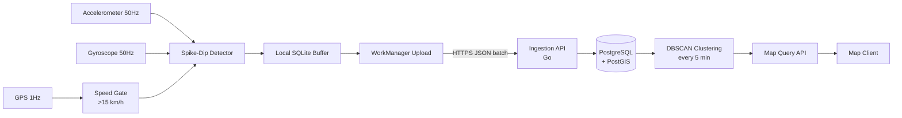

# Asphalt

Asphalt detects road anomalies (potholes, speed bumps, rough patches) using
smartphone sensor data and aggregates them into a queryable road quality map.

It is a privacy-first, offline-first, battery-aware system designed for real
deployment conditions: noisy sensors, intermittent connectivity, and heterogeneous
device hardware.

---

## How It Works

A driver installs an app that includes the Asphalt SDK. While driving above
15 km/h, the SDK samples the accelerometer at 50Hz. When the Z-axis reading
deviates sharply from the rolling baseline (the pothole spike-dip signature),
and the gyroscope confirms actual physical motion, the SDK records the event
with a GPS coordinate and intensity score.

Events are batched locally and uploaded to the backend when connectivity is
available. The backend clusters nearby events, scores cluster confidence based
on how many independent reports agree, and exposes the results via a map query
API.

No raw sensor data leaves the device. No user accounts or identifiers are
collected. Location data is attached only to detected anomaly events, not
tracked continuously.

See [docs/sensor-model.md](docs/sensor-model.md) for a full explanation of the
physics and signal patterns.

---

## Project Structure

```
asphalt/
  sdk/android/asphalt-sdk/     Android SDK (Kotlin)
  backend/                     Backend server (Go)
  demo-app/android/            Demo Android application
  contracts/                   JSON schemas and OpenAPI spec
  docs/                        Architecture, sensor model, setup guides
```

---

## Architecture



Full architecture with component breakdown: [docs/architecture.md](docs/architecture.md)

---

## Quick Start

### Backend

```bash
cd backend
docker compose up --build
# API available at http://localhost:8080
```

Test the health endpoint:
```bash
curl http://localhost:8080/v1/health
```

Submit a test event batch:
```bash
curl -X POST http://localhost:8080/v1/ingest/batch \
  -H "Content-Type: application/json" \
  -d @contracts/example-batch.json
```

Full backend documentation: [docs/backend-setup.md](docs/backend-setup.md)

### Android SDK

```kotlin
// In Application.onCreate()
Asphalt.init(this, AsphaltConfig(
    ingestUrl = "https://your-backend.example.com/v1/ingest/batch"
))

// Start detection
Asphalt.start()

// Stop detection
Asphalt.stop()
```

Full SDK documentation: [docs/sdk-integration.md](docs/sdk-integration.md)

---

## Sensor Model

The accelerometer detects vertical displacement caused by road anomalies.
A pothole creates a characteristic spike-dip Z-axis signature over 150-400ms.
The gyroscope confirms physical angular motion, filtering out sensor noise
from vibration, music, and loose phone mounts. GPS speed gates the system
to activate only during vehicle travel above 15 km/h.

See [docs/sensor-model.md](docs/sensor-model.md) for sample signal patterns
and full explanation.

---

## Design Principles

**Battery aware**: Sensors are inactive below 15 km/h. Uploads use WorkManager
to batch events and avoid unnecessary radio wake-ups.

**Privacy first**: No PII collected. No device identifiers, user accounts, or
continuous location tracking. Location is recorded only when an anomaly is
detected.

**Noise tolerant**: Three-sensor fusion (accelerometer + gyroscope + GPS) with
a rolling baseline and configurable thresholds. No single sensor is trusted alone.

**Offline first**: Events are written to local SQLite before any network
operation. Upload failures are retried by WorkManager with exponential backoff.

**Modular**: The SDK, backend, and contracts are independent. The SDK can be
used with a custom backend. The backend can accept events from non-Android sources.

---

## Backend Choice: Go

Go was chosen over Node.js for the backend:
- Goroutine concurrency handles many simultaneous batch uploads with low memory
- Predictable GC latency avoids client timeout-caused retries
- Single static binary, minimal deployment footprint
- Strong standard library covers HTTP, JSON, and SQL without heavy dependencies

---

## Known Limitations

- Phone must be in a flat orientation (face up) for optimal Z-axis detection.
  Vertical phone holders degrade detection quality.
- No per-device sensor calibration in v1. Threshold is global (4.0 m/s^2).
- Rural roads with sparse users will have low confidence scores until more
  drivers report the same location.
- GPS spoofing is not prevented in v1; multi-report confidence scoring
  limits but does not eliminate its impact.

Full limitations: [docs/limitations.md](docs/limitations.md)

---

## API Contract

The event schema, batch format, and HTTP API are defined in `contracts/`:

- `contracts/event.schema.json` - single event JSON schema
- `contracts/batch.schema.json` - batch upload JSON schema
- `contracts/api.yaml` - OpenAPI 3.1 specification

---

## License

Apache 2.0. See [LICENSE](LICENSE).
