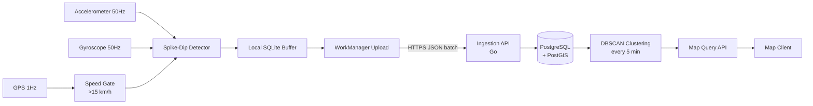

# Asphalt

Asphalt detects road anomalies (potholes, speed bumps, rough patches) using
smartphone sensor data and aggregates them into a queryable road quality map.

It is a privacy-first, offline-first, battery-aware system designed for real
deployment conditions: noisy sensors, intermittent connectivity, and heterogeneous
device hardware.

---

## How It Works

A driver installs an app that includes the Asphalt SDK. The app declares the
vehicle type (two-wheeler, three-wheeler, or four-wheeler) at initialisation
time. While driving above 15 km/h, the SDK samples the accelerometer at 50Hz.
When the Z-axis reading deviates sharply from the rolling baseline (the pothole
spike-dip signature), and the gyroscope confirms actual physical motion, the SDK
records the event with a GPS coordinate and intensity score.

For three-wheelers (auto rickshaws), additional on-device filters suppress
false positives from engine vibration, turn dynamics, and lateral wobble before
any event is recorded.

Events are batched locally and uploaded to the backend when connectivity is
available. The backend clusters nearby events, scores cluster confidence based
on how many independent reports agree, normalises signal strength across vehicle
types, and exposes the results via a map query API.

No raw sensor data leaves the device. No user accounts or identifiers are
collected. Location data is attached only to detected anomaly events, not
tracked continuously.

See [docs/sensor-model.md](docs/sensor-model.md) and
[docs/vehicle-profiles.md](docs/vehicle-profiles.md) for detailed explanations.

---

## Project Structure

```
asphalt/
  sdk/android/asphalt-sdk/     Android SDK (Kotlin)
  backend/                     Backend server (Go)
  demo-app/android/            Demo Android application
  contracts/                   JSON schemas and OpenAPI spec
  docs/                        Architecture, sensor model, setup guides
```

---

## Architecture



Full architecture with component breakdown: [docs/architecture.md](docs/architecture.md)

---

## Quick Start

### Backend

```bash
cd backend
docker compose up --build
# API available at http://localhost:8080
```

Test the health endpoint:
```bash
curl http://localhost:8080/v1/health
```

Submit a test event batch:
```bash
curl -X POST http://localhost:8080/v1/ingest/batch \
  -H "Content-Type: application/json" \
  -d @contracts/example-batch.json
```

Full backend documentation: [docs/backend-setup.md](docs/backend-setup.md)

### Android SDK

```kotlin
// In Application.onCreate()
Asphalt.init(this, AsphaltConfig(
    ingestUrl = "https://your-backend.example.com/v1/ingest/batch",
    vehicleType = VehicleType.THREE_WHEELER  // or TWO_WHEELER, FOUR_WHEELER
))

// Start detection (call after location permission is granted)
Asphalt.start()

// Stop detection
Asphalt.stop()
```

Full SDK documentation: [docs/sdk-integration.md](docs/sdk-integration.md)

Vehicle profile documentation: [docs/vehicle-profiles.md](docs/vehicle-profiles.md)

### Demo APK (real-device testing)

The demo app at `demo-app/android/` is a self-contained APK you can install on
a physical Android device to test detection end-to-end.

**Prerequisites**

- Android Studio Hedgehog (2023.1) or later, or Android SDK command-line tools
- A physical Android device running Android 7.0+ (API 24) with Google Play
  Services installed (standard on all non-China devices)
- USB debugging enabled on the device
- The backend running and reachable from the device (see Backend section above)

> **No `google-services.json` needed.** The app only uses the Fused Location
> Provider (`play-services-location`), which is part of Google Play Services
> already installed on the device. Firebase and the `google-services` Gradle
> plugin are not used and do not need to be configured.

**Steps**

1. Create `demo-app/android/local.properties` pointing at your Android SDK:
   ```
   sdk.dir=/path/to/your/Android/sdk
   ```
   On macOS this is typically `~/Library/Android/sdk`.
   On Linux, `~/Android/Sdk`. On Windows, `C:\Users\<you>\AppData\Local\Android\Sdk`.

2. Set the backend URL for your device.

   If testing on an **emulator**, the default `http://10.0.2.2:8080` (emulator
   alias for host localhost) already works.

   If testing on a **physical device** over Wi-Fi, edit the `debug` block in
   `demo-app/android/app/build.gradle.kts` and replace `10.0.2.2` with your
   development machine's local IP address:
   ```kotlin
   buildConfigField("String", "INGEST_URL",
       "\"http://192.168.1.42:8080/v1/ingest/batch\"")
   ```

3. Build and install the debug APK:
   ```bash
   cd demo-app/android
   ./gradlew installDebug
   ```

4. Open the app, grant location permission when prompted, then press **Start**.

**Debug vs release behaviour**

| Behaviour | Debug build | Release build |
|-----------|-------------|---------------|
| Speed gate | 5 km/h | 15 km/h |
| Logging | Verbose (Logcat tag: `Asphalt`) | Silent |
| Backend URL | `http://10.0.2.2:8080` | Set in `build.gradle.kts` |
| Obfuscation | Off | R8 + ProGuard |

The lower speed gate in debug builds means you can trigger real detections while
walking slowly, without needing to drive.

---

## Sensor Model

The accelerometer detects vertical displacement caused by road anomalies.
A pothole creates a characteristic spike-dip Z-axis signature over 150-400ms.
The gyroscope confirms physical angular motion, filtering out sensor noise
from vibration, music, and loose phone mounts. GPS speed gates the system
to activate only during vehicle travel above 15 km/h.

See [docs/sensor-model.md](docs/sensor-model.md) for sample signal patterns
and full explanation.

---

## Vehicle Support

Asphalt explicitly models three vehicle categories:

| Vehicle | Examples | Detection Threshold | Special Handling |
|---------|---------|---------------------|-----------------|
| Four-wheeler | Cars, SUVs, taxis | 4.0 m/s^2 | Standard |
| Three-wheeler | Auto rickshaws, tuk-tuks | 5.5 m/s^2 | Engine vibration filter, turn suppression, lateral wobble suppression |
| Two-wheeler | Motorcycles, scooters | 5.0 m/s^2 | Turn suppression, wider baseline window |

### Why Indian traffic makes this problem harder

Indian urban roads present a combination of conditions not found in most road
detection research:

- **Mixed fleet**: The same road segment is used simultaneously by two-wheelers,
  three-wheelers, cars, trucks, and cycle rickshaws. Road damage affects each
  vehicle type differently. A pothole that barely registers in a car may be
  severe for a scooter.

- **Auto rickshaws as dominant mode**: In cities like Mumbai, Delhi, and
  Bengaluru, autos account for a large fraction of road kilometres driven.
  Any road quality system that cannot handle auto data is blind to a significant
  portion of the fleet. At the same time, autos have higher sensor noise floors
  than cars, making them harder to process correctly.

- **Unofficial road modifications**: Speed bumps built by resident welfare
  associations, road patches of varying quality, and temporary diversions are
  common. These are not in any map database and must be detected from sensor
  data alone.

- **Dense, slow traffic**: Congested corridors operate at 5-15 km/h for hours
  daily. The speed gate (minimum 15 km/h for activation) means these segments
  are harder to survey during peak hours.

- **GPS degradation**: Tall buildings, flyovers, and narrow lanes cause GPS
  multipath errors. Urban canyon GPS in Indian cities can degrade to 30-50m
  accuracy, which is above the 30m cluster radius.

### How Asphalt accounts for this diversity

- **Per-vehicle signal profiles**: Each vehicle type has its own detection
  threshold, gyro confirmation threshold, baseline window size, and suppression
  parameters derived from real-world auto and bike vibration characteristics.

- **On-device three-wheeler filtering**: Engine vibration (zero-crossing rate),
  turns (sustained lateral gyro), and wobble (sustained roll) are suppressed
  before any event reaches the database. This happens on the phone, so no
  false-positive events are uploaded.

- **Cross-vehicle confidence bonus**: A cluster confirmed by both autos and cars
  receives a confidence boost of +0.08 per additional vehicle type. This rewards
  the most reliable signal: multiple vehicle categories independently reporting
  the same location.

- **Vehicle type signal weights**: Backend intensity normalisation weights
  three-wheeler events at 0.7x and two-wheeler events at 0.8x relative to
  cars, reflecting their higher per-event uncertainty. A cluster dominated by
  auto reports but also confirmed by one car will have substantially higher
  confidence than an auto-only cluster.

---

## Design Principles

**Battery aware**: Sensors are inactive below 15 km/h. Uploads use WorkManager
to batch events and avoid unnecessary radio wake-ups.

**Privacy first**: No PII collected. No device identifiers, user accounts, or
continuous location tracking. Location is recorded only when an anomaly is
detected.

**Noise tolerant**: Three-sensor fusion (accelerometer + gyroscope + GPS) with
a rolling baseline and configurable thresholds. No single sensor is trusted alone.

**Offline first**: Events are written to local SQLite before any network
operation. Upload failures are retried by WorkManager with exponential backoff.

**Modular**: The SDK, backend, and contracts are independent. The SDK can be
used with a custom backend. The backend can accept events from non-Android sources.

---

## Backend Choice: Go

Go was chosen over Node.js for the backend:
- Goroutine concurrency handles many simultaneous batch uploads with low memory
- Predictable GC latency avoids client timeout-caused retries
- Single static binary, minimal deployment footprint
- Strong standard library covers HTTP, JSON, and SQL without heavy dependencies

---

## Known Limitations

- Phone must be in a flat orientation (face up) for optimal Z-axis detection.
  Vertical phone holders degrade detection quality.
- No per-device sensor calibration in v1. Threshold is global (4.0 m/s^2).
- Rural roads with sparse users will have low confidence scores until more
  drivers report the same location.
- GPS spoofing is not prevented in v1; multi-report confidence scoring
  limits but does not eliminate its impact.
- Background collection stops when the screen locks on Android 10+ unless the
  integrating app runs a Foreground Service with `foregroundServiceType="location"`.
  The demo app does not include a Foreground Service; it is intended for
  screen-on testing only.
- `DeviceMeta` (manufacturer, model, SDK version) is populated correctly in the
  demo app's simulated events but defaults to empty strings in real detections
  in v1. This limits device-level analysis on the backend.

Full limitations: [docs/limitations.md](docs/limitations.md)

---

## API Contract

The event schema, batch format, and HTTP API are defined in `contracts/`:

- `contracts/event.schema.json` - single event JSON schema
- `contracts/batch.schema.json` - batch upload JSON schema
- `contracts/api.yaml` - OpenAPI 3.1 specification

---

## License

Apache 2.0. See [LICENSE](LICENSE).
