# Asphalt Architecture

## Overview

Asphalt is a pipeline from raw smartphone sensors to a queryable road quality
map. It is designed around three constraints: battery, privacy, and noise.

The system is composed of:
1. An Android SDK that runs on users' devices during driving
2. A backend that ingests, stores, clusters, and serves anomaly data
3. A query API for map clients

---

## System Architecture Diagram

```mermaid
flowchart TD
    subgraph Device["Android Device"]
        direction TB

        subgraph Sensors["Sensor Layer"]
            ACCEL["Accelerometer\n50Hz, Z-axis primary"]
            GYRO["Gyroscope\n50Hz, confirmation"]
            GPS["FusedLocationProvider\n1Hz, speed + coordinates"]
        end

        subgraph Preprocessing["On-Device Preprocessing"]
            SPEED_GATE["Speed Gate\n>15 km/h required\nActivates/deactivates sensors"]
            BASELINE["Rolling Baseline\nMedian, per-vehicle window\n64-96 samples (1.3-1.9 s at 50Hz)"]
        end

        subgraph Detection["Event Detection"]
            SPIKE_DIP["Spike-Dip Detector\nZ-axis delta threshold\n4.0-5.5 m/s^2 by vehicle type"]
            GYRO_CONFIRM["Gyro Confirmation\nMagnitude threshold\n0.30-0.55 rad/s by vehicle type"]
            CLASSIFIER["Signature Classifier\nTemporal ordering of peak/dip\nPothole vs Bump vs Rough"]
            INTENSITY["Intensity Scorer\nNormalised 0.0-1.0\nSpeed-adjusted"]
        end

        subgraph Storage["Offline Buffer"]
            ROOM["Room Database\nSQLite on-device\nEvents stored before upload"]
        end

        subgraph Upload["Upload Layer"]
            WORKER["WorkManager\nPeriodic flush (5 min)\nBatches up to 500 events\nExponential backoff retry"]
        end
    end

    subgraph Backend["Backend (Go)"]
        direction TB

        subgraph Ingestion["Ingestion Service"]
            INGEST_API["POST /v1/ingest/batch\nHTTP/JSON\nIdempotent via batch_id"]
            VALIDATOR["Event Validator\nSchema + range checks\nTimestamp sanity"]
            DEDUP["Batch Deduplication\nbatch_id table lookup"]
        end

        subgraph Processing["Processing Pipeline"]
            PG[("PostgreSQL + PostGIS\nroad_events table\nSpatial index on geom")]
            CLUSTER_WORKER["Clustering Worker\nDBSCAN, 30m radius\nRuns every 5 minutes"]
            CLUSTER_TABLE[("anomaly_clusters table\nConfidence scored\nUpdated incrementally")]
        end

        subgraph QueryAPI["Query API"]
            TILE_API["GET /v1/map/tiles/{z}/{x}/{y}\nSlippy tile bounds -> clusters"]
            BBOX_API["GET /v1/map/clusters\nBounding box query"]
        end
    end

    subgraph Clients["Map Clients"]
        MAP_APP["Mobile or Web Map\nRenders cluster markers\nColour by intensity"]
    end

    %% Sensor -> Preprocessing
    ACCEL --> SPEED_GATE
    GPS --> SPEED_GATE
    SPEED_GATE --> BASELINE

    %% Preprocessing -> Detection
    BASELINE --> SPIKE_DIP
    GYRO --> GYRO_CONFIRM
    SPIKE_DIP --> GYRO_CONFIRM
    GYRO_CONFIRM --> CLASSIFIER
    CLASSIFIER --> INTENSITY

    %% Detection -> Storage
    INTENSITY --> ROOM

    %% Storage -> Upload
    ROOM --> WORKER

    %% Upload -> Backend
    WORKER -->|"HTTPS JSON batch"| INGEST_API

    %% Ingestion pipeline
    INGEST_API --> DEDUP
    DEDUP --> VALIDATOR
    VALIDATOR --> PG

    %% Clustering
    PG --> CLUSTER_WORKER
    CLUSTER_WORKER --> CLUSTER_TABLE

    %% Query
    CLUSTER_TABLE --> TILE_API
    CLUSTER_TABLE --> BBOX_API
    TILE_API --> MAP_APP
    BBOX_API --> MAP_APP
```



---

## Component Breakdown

### Sensor Layer

Three sensors are used in combination:

| Sensor | Purpose | Sample Rate |
|--------|---------|-------------|
| Accelerometer | Primary anomaly signal (Z-axis vertical displacement) | 50Hz |
| Gyroscope | Motion validation, filters sensor noise | 50Hz |
| GPS (FLP) | Speed gate, event geolocation | 1Hz |

All three must agree before an event is recorded. This is the sensor fusion
principle: no single sensor is trusted alone.

### Speed Gate

The speed gate is the most impactful battery optimisation. Accelerometer and
gyroscope are unregistered below 15 km/h. At 50Hz sampling, each sensor draws
approximately 0.5-1.5mA continuously. Inactive sensors draw near zero.

On a typical urban drive (60% of time above threshold), this halves sensor
power consumption compared to always-on collection.

### On-Device Detection

Detection runs synchronously on the sensor callback thread. It is designed to
complete in under 1ms to avoid dropping sensor samples. No blocking I/O, no
network calls, no heavy allocation.

Events are written to Room (SQLite) asynchronously on a background coroutine.

### Offline Buffer

WorkManager handles all upload scheduling. The SDK never opens a network
connection synchronously. This means:
- Detection works with no network connectivity
- Uploads happen on the device's schedule (respecting Doze mode)
- Failed uploads are automatically retried with exponential backoff

### Backend

Go was chosen over Node.js for the following reasons:

1. **Concurrency model**: Go's goroutines handle thousands of simultaneous
   batch uploads with low memory overhead. Each request handler runs in its
   own goroutine; the runtime schedules them efficiently on available cores.

2. **Predictable latency**: Go's GC is designed for low-pause operation.
   Ingestion latency must be consistent to avoid client timeout-related retries.

3. **Single binary deployment**: No runtime dependency (no JVM, no Node
   version manager). The Dockerfile produces a ~7MB static binary.

4. **Standard library strength**: `net/http`, `database/sql`, and `encoding/json`
   cover all needs without heavy third-party dependencies. Less surface area
   to audit for security vulnerabilities.

The backend is stateless. All state lives in PostgreSQL. Horizontal scaling
requires only adding more container replicas behind a load balancer.

### Clustering Pipeline

The clustering worker runs DBSCAN on unclustered events every 5 minutes.
DBSCAN was chosen because:
- Road anomalies do not form round clusters; they form linear clusters
  along road segments. DBSCAN finds arbitrary shapes.
- No need to specify the number of clusters.
- Noise points (isolated false positives) are naturally excluded.

Confidence scoring uses five components:
1. Weighted event count (log scale, saturates near 1.0 at ~20 events; each event
   is weighted by vehicle signal reliability: car=1.0, two-wheeler=0.8, three-wheeler=0.7)
2. Type consistency (fraction with the dominant anomaly type)
3. Recency (decay over 90 days)
4. Vehicle diversity bonus (+0.08 per additional vehicle type beyond the first;
   a pothole confirmed by both autos and cars is treated as significantly more reliable)
5. Three-wheeler-only penalty (-0.08 if all events are from three-wheelers AND the
   cluster has fewer than 4 events, to account for their higher residual false-positive rate)

A single isolated event never appears on the map because DBSCAN requires at
least 2 nearby events (within 30m) to form a cluster; single events are
classified as noise and discarded.

Two nearby four-wheeler events form a cluster with confidence ~0.58, well above
the default tile API display threshold of 0.30. Two three-wheeler events score
~0.46 after the sparse-auto penalty, which still clears the default threshold.
Mixed-vehicle clusters (e.g. one auto + one car) score higher due to the
diversity bonus (+0.08 per additional vehicle type).

---

## Data Flow: End to End

```
Drive starts
  GPS speed: 22 km/h
  -> Speed gate opens
  -> Accelerometer + Gyroscope registered at 50Hz

At 00:00.000:
  Z-axis: 9.81 (baseline)

At 00:00.150:
  Z-axis drops to 7.2 (dip, wheel enters pothole)
  Gyro magnitude: 0.92 rad/s (pitch confirmed)

At 00:00.210:
  Z-axis spikes to 15.8 (rebound)
  Delta from baseline: 6.0 m/s^2 (exceeds 4.0 threshold)
  Gyro still active

  -> AnomalyDetector fires
  -> Signature: dip before spike -> POTHOLE
  -> Intensity: (6.0 / 12.0) * 1.1 (speed factor) = 0.55
  -> GPS fix: lat=12.9716, lon=77.5946, accuracy=8m  (Bengaluru)
  -> Event stored to Room DB

...more driving...

After 5 minutes OR buffer fills to 200:
  WorkManager fires UploadWorker
  -> 12 events batched
  -> POST /v1/ingest/batch with batch_id=UUID
  -> Server validates, deduplicates, stores to PostgreSQL
  -> Events marked as uploaded in Room DB

At T+5 minutes (backend side):
  Clustering worker runs DBSCAN
  -> 3 events within 30m -> new cluster at centroid
  -> Confidence: 0.60 (3 four-wheeler events, consistent type, recent)
  -> Cluster written to anomaly_clusters table

Map client query:
  GET /v1/map/clusters?min_lat=12.96&min_lon=77.58&max_lat=12.98&max_lon=77.61
  -> Returns cluster with confidence=0.60, intensity=0.55
  -> Map renders amber marker at lat=12.9716, lon=77.5946  (Bengaluru)
```

---

## Deployment Topology

```
                         +------------------+
                         |   Load Balancer  |
                         +--------+---------+
                                  |
               +------------------+-------------------+
               |                                      |
     +---------+--------+                  +----------+--------+
     |   API Server 1   |                  |   API Server 2   |
     |   (Go binary)    |                  |   (Go binary)    |
     +---------+--------+                  +----------+--------+
               |                                      |
               +------------------+-------------------+
                                  |
                         +--------+---------+
                         |   PostgreSQL     |
                         |   + PostGIS      |
                         |   (Primary)      |
                         +------------------+
```

For a single-operator deployment, a single VM running docker-compose is
sufficient for up to approximately 10,000 active users. The main bottleneck
is PostgreSQL write throughput, which can be addressed with connection pooling
(PgBouncer) and read replicas for the query endpoints.
